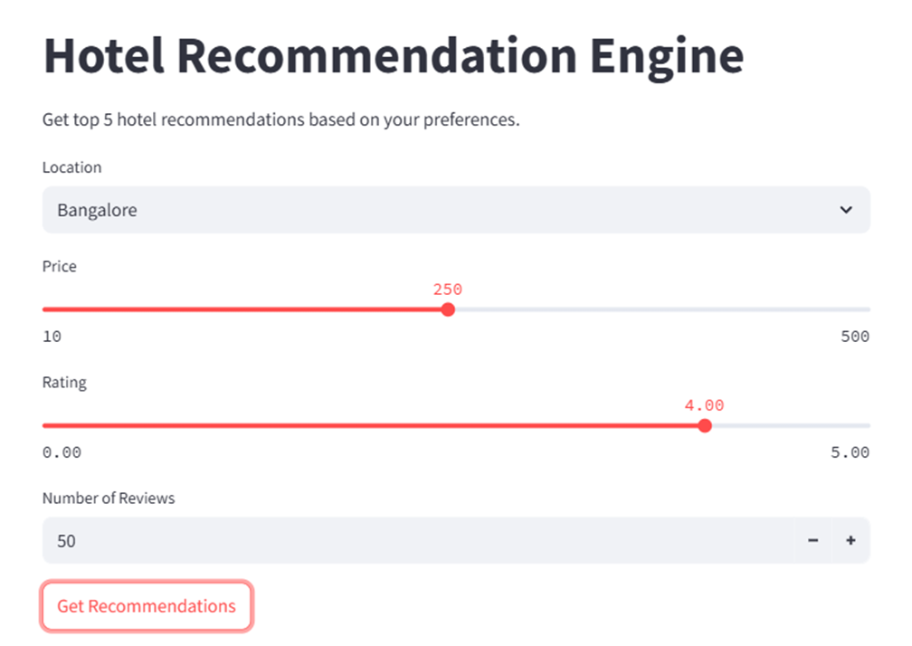
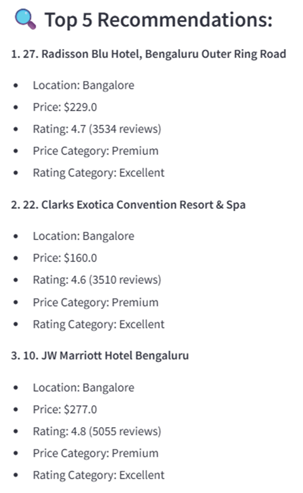

# hotel-recommendation-engine
A Machine Learning-based Hotel Recommendation System that provides personalized hotel suggestions based on user preferences using KNN & Streamlit, powered by Azure SQL Database.

**Project Objective**
To develop an intelligent Hotel Recommendation Engine that suggests top hotels based on user-defined preferences such as location, price, rating, and number of reviews, using machine learning models with a simple, interactive Streamlit UI.

**Demo Preview**

**Project Architecture**
    UserInput["User Inputs (Location, Price, Rating, Reviews)"] -->|Frontend| StreamlitApp["Streamlit Web App"]
    
    StreamlitApp --> LoadData["Load Offerings"]
    
    StreamlitApp --> LoadModels["Load Preprocessor & KNN Model"]
    
    StreamlitApp --> Preprocess["Preprocess Input & Offerings Data"]
    
    Preprocess --> Recommend["Compute Similarity (Euclidean Distance)"]
    
    Recommend --> Display["Show Top 5 Recommendations"]

**Tech Stack**

Frontend -> Streamlit

Backend -> Python, Scikit-learn, Pandas

Database -> Azure SQL Database, SQLAlchemy, pyodbc

Modeling -> K-Nearest Neighbors, Custom Preprocessing

Serialization -> joblib (for .pkl files)

**Workflow**

1] Load hotel data & models.

2] User inputs preferences (location, price, rating).

3] Data is preprocessed (categorical encoding, scaling, clustering).

4] KNN model computes nearest hotels (Euclidean distance).

5] Display top 5 recommendations with scores.

**Installation & Usage**
**1]Clone the Repository**
[git clone https://github.com/yourusername/hotel-recommendation.git]
cd hotel-recommendation
**2]Install Dependencies**
pip install -r requirements.txt
**3]Run the Streamlit App**
streamlit run app.py
